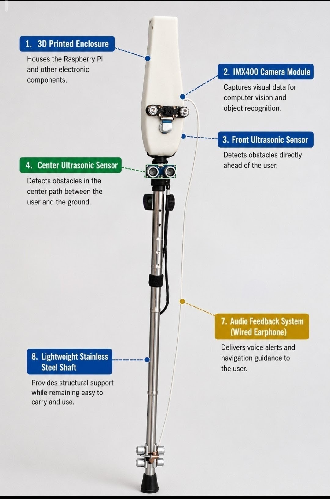
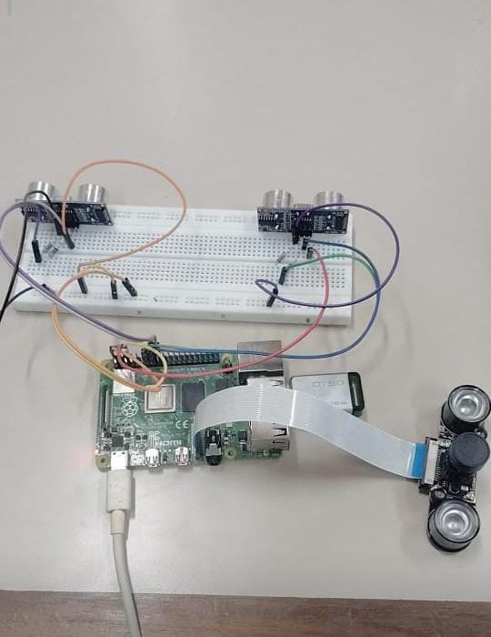
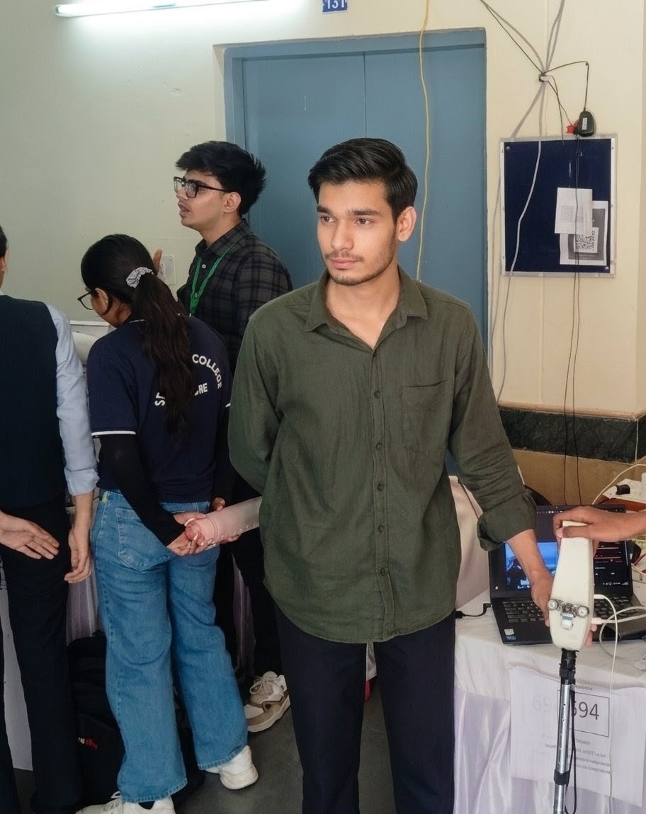
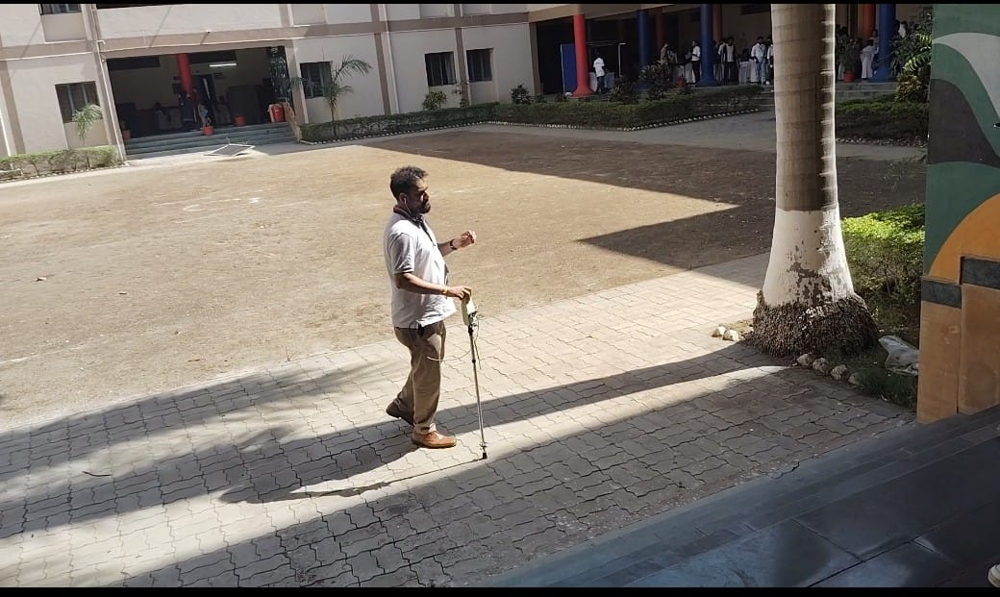
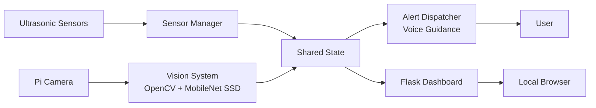

<h1 align="center">VisionAI Smart Stick</h1>

> AI-powered assistive navigation for visually impaired individuals.
>
> Combining Raspberry Pi, computer vision, and ultrasonic sensing for real-time awareness.

[](https://www.python.org/)
[](https://www.raspberrypi.com/)
[](https://opencv.org/)
[](https://flask.palletsprojects.com/)
[](#project-architecture)



## Highlights

- **Assistive edge AI:** combines live sensing, computer vision, and spoken feedback on a Raspberry Pi.
- **Safety-aware alerts:** prioritizes the most relevant navigation cue instead of overlapping messages.
- **Built for demonstration:** pairs a portable hardware prototype with a local monitoring dashboard.

> **Prototype notice:** This project is an experimental assistive-navigation system and is not a certified mobility aid.

## Demo

<video src="docs/videos/demo.mp4" controls width="100%" poster="docs/images/hero.jpeg">
  Your browser does not support embedded video.
</video>

[▶ Download the project demo](docs/videos/demo.mp4)

## Project Overview

VisionAI Smart Stick is a Raspberry Pi–based navigation prototype that helps users become aware of nearby obstacles and environmental changes.
Ultrasonic sensors monitor left, right, and downward-facing distances, while a camera recognizes selected objects.
A priority-based alert system provides concise spoken feedback, with a lightweight Flask dashboard for local monitoring.

## Key Features

| Feature | Description |
|---|---|
| 🧭 **Obstacle Awareness** | Detects nearby left and right obstacles with ultrasonic sensors. |
| 🪜 **Stair & Drop Detection** | Identifies meaningful changes in floor distance. |
| 👁️ **Object Detection** | Uses MobileNet SSD and OpenCV to detect people and chairs. |
| 🔊 **Voice Guidance** | Speaks one prioritized warning at a time for clearer feedback. |
| 📺 **Live Dashboard** | Displays sensor data and an annotated camera stream on the local network. |
| ⚡ **Edge Processing** | Runs core sensing and inference locally on the Raspberry Pi. |

## Hardware Components

| Component | Purpose |
|---|---|
| Raspberry Pi 4 | Runs the application, AI pipeline, and local dashboard. |
| Raspberry Pi Camera Module | Captures live frames for object detection. |
| 3× Ultrasonic Sensors | Measures left, right, and downward-facing distances. |
| Audio Output | Delivers spoken guidance to the user. |
| Level Shifters / Voltage Dividers | Protect Raspberry Pi GPIO inputs from 5 V ECHO signals. |

## Project Gallery

| Final Smart Stick | Hardware Setup |
|---|---|
|  |  |
| Me with the Smart Stick | Hackathon Jury Demonstration |
|  |  |

## Project Architecture



Sensor and vision modules publish the latest state independently.
The alert engine and dashboard then consume that state without competing for hardware access.

## Folder Structure

```text
VisionAi-STICK/
├── main.py                  # Application entry point
├── sensors.py               # Ultrasonic sensing and floor-change logic
├── vision.py                # Camera capture and object detection
├── alerts.py                # Alert prioritization and audio feedback
├── web.py                   # Flask dashboard routes
├── index.html               # Local dashboard interface
├── diagnose.py              # Raspberry Pi preflight checks
├── requirements.txt         # Python dependencies
├── models/                  # Local MobileNet SSD model files
└── docs/
    ├── images/              # Project photographs
    └── videos/              # Demo footage
```

## Quick Start

Run this project on a configured Raspberry Pi with the required hardware connected.

```bash
git clone <your-repository-url>
cd VisionAi-STICK
python3 -m venv venv --system-site-packages
source venv/bin/activate
pip install -r requirements.txt
python3 main.py --floor-distance 82
```

Open `http://<RASPBERRY_PI_IP>:5000` from a device on the same network to view the dashboard.

Model files, Pi OS packages, calibration, safe wiring, and full operating instructions are covered in the project documentation.

## Documentation

For full technical details, setup guidance, learning notes, and deployment information, explore:

| Document | Description |
|---|---|
| [PROJECT_GUIDE.md](PROJECT_GUIDE.md) | Complete technical documentation and setup reference. |
| [LEARNING_GUIDE.md](LEARNING_GUIDE.md) | Learning notes, concepts, and architecture walkthrough. |
| [DEPLOYMENT.md](DEPLOYMENT.md) | Deployment and project showcase guidance. |

Start with **PROJECT_GUIDE.md** for the complete technical explanation behind this landing page.

## Future Improvements

- Add GPS-assisted outdoor navigation.
- Introduce haptic feedback alongside voice alerts.
- Detect additional safety-relevant objects.
- Improve enclosure design and battery management.
- Add user-configurable alert profiles.

## Author(About me :)

Created by **Govind Singh Chouhan**.

Interested in accessibility, embedded AI, or computer vision? Feedback and thoughtful contributions are welcome.

---

*Built with Raspberry Pi, Python, OpenCV, Flask, and a focus on accessible innovation.*

*VisionAI Smart Stick — technology in service of independent mobility.*
